# Contributing

This project welcomes contributions and suggestions. Most contributions require you to agree to a
Contributor License Agreement (CLA) declaring that you have the right to, and actually do, grant us
the rights to use your contribution. For details, visit https://cla.opensource.microsoft.com.

There are several ways to contribute to this repository; here are the most common scenarios:

| Scenario | What to Do |
| -------- | ---------- |
| Make a suggestion or recommend new content | Open a new **issue** |
| Correct a typo, link, or other minor change | Create a **Pull Request** |
| Create an entirely new Learning Plan Resource | Create a **Pull Request** |

Read more on how to do these below.

## Open an Issue

We use **issues** to track general feedback and suggestions. Examples might include suggesting new content for a product or technical scenario that we haven't created yet, or providing feedback, problems or concerns with existing content. Follow these steps to create a new issue:

1. Make sure you have signed into GitHub.com with your GitHub account.
2. On the top of the screen within the Partner Resources repository, click *issues* and then the **New Issue** button:

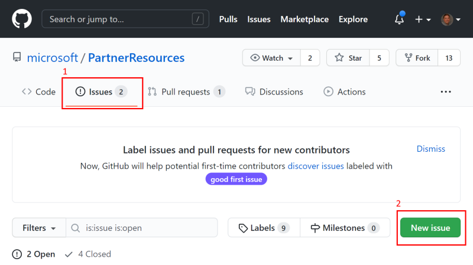

3. Add a title and description and click **Submit new issue**. Please be as thorough as possible and provide relevant links if available.

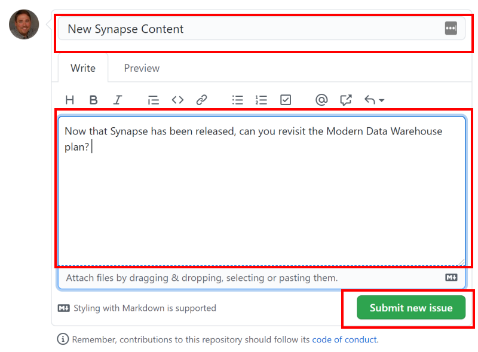

4. Once the issue has been created, it's available for the team and others to comment on. You can revisit this issue to add more information or participate in any ongoing disussion. Once an issue has been resolved, it will be closed by the team (you may also close the issue).

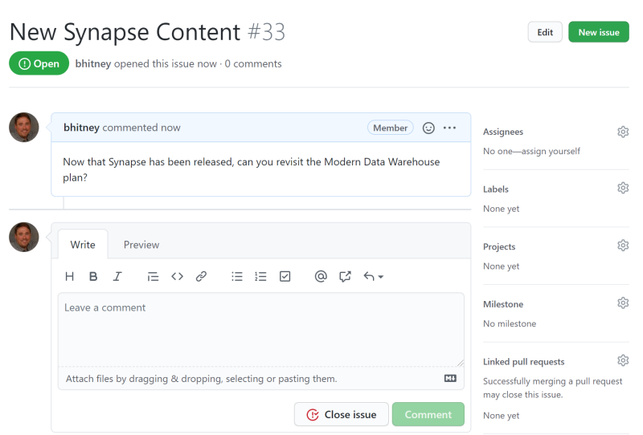

## Modfying a document on Github

If you have a minor change -- such as a typo, updating a link, adding a line here or there -- you can edit the file directly on GitHub.com without having installing additional tools and software. Naturally, use whatever tools/editors you are most comfortable with. When you create these changes, the document is essentially copied into your own personal repository, and a **pull request** is then created that notifies the team that you'd like to see a change implemented. If the reviewing team accepts the change, these changes are merged into the original document. Similar to **issues** above, **pull requests** have a discussion thread in the event there are any questions or additional information is needed. 

Please refer to our [Template](/LearningPlanResources/Template.md) if you're unfamiliar with the sections we typically like to see in a document (of course, additional sections are always welcomed as appropriate). To make changes:

1. Make sure you have signed into GitHub.com with your GitHub account.
2. Go to the page you want to edit and click the edit button near the top right:

   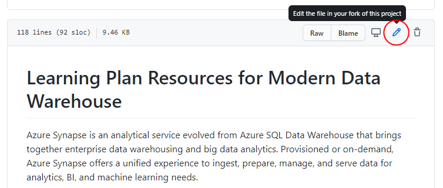

3. A fork of the project will be created in your account for editing purposes. Files in GitHub are written and edited using Markdown language. For help on using Markdown, see [Mastering Markdown](https://guides.github.com/features/mastering-markdown/). Select the **Preview changes** tab to view your changes as you go.  The editor will look like this:

   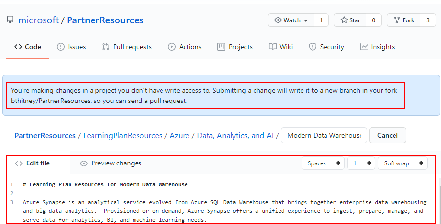

6. When you're finished making changes, go to the **Propose file change** section at the bottom of the page:

   - A brief title is required. By default, the title is the name of the file, but you can change it.
   - Optionally, you can enter more details in the **Add an optional extended description** box.

   When you're ready, click the green **Propose file change** button.

      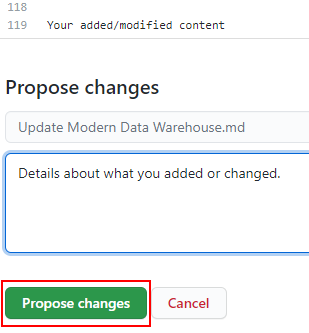

7. On the **Comparing changes** page that appears, click the green **Create pull request** button. A check will be performed and allow you to confirm the submission.

      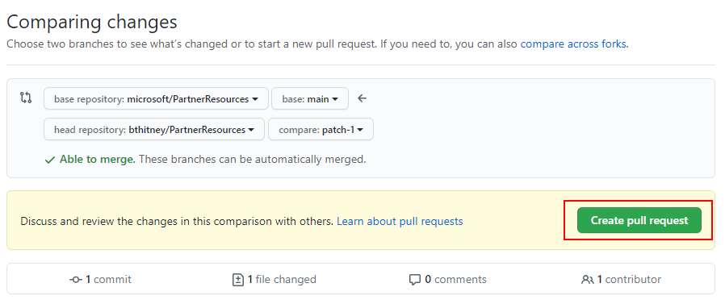

8. A member of the team will review and approve your request, or if there are any issues, will respond with questions or comments.

## Creating new content

If you have multiple edits or are creating new plans and content, it's usually easiest to work on these outside of GitHub using an editor of your choice. Some popular editors include [Visual Studio Code](https://code.visualstudio.com/), [Visual Studio](https://visualstudio.microsoft.com), [Notepad++](https://notepad-plus-plus.org/), and countless more.  Some text editors, like Visual Studio Code, allow you to preview MD files so you can be sure links and formatting appear as intended.

To get started, clone the repository either locally or into your own GitHub account. You may use GitHub.com to fork the repository into your own account by clicking the fork button near the top right:

If you are creating new content locally on your computer, many software packages allow you to clone a repository from GitHub directly (such as Visual Studio Code), or you may use a tool like [GitHub Desktop](https://desktop.github.com/) to manage downloading the repository and uploading any changes; this allows you to use whatever tool you'd like. More on using GitHub desktop in a bit.

The key to remember is that all documentation is stored in Markdown (MD) format. MD is a lightweight markup syntax for documents that allows them to be easily created and consumed. MD files may contain images, lists, and tables -- use this [Mastering Markdown guide](https://guides.github.com/features/mastering-markdown/) to learn more. Also, while you can copy any existing plan to use as a template, we have an [emtpy template](/LearningPlanResources/Template.md) that you can use to get started.

If you are including any images in your plan, be sure to upload them to the local assets folder. For example, under Business Applications -> Customer Engagement, there are 2 images in the assets folder that are used in the plans in the Customer Engagement section:

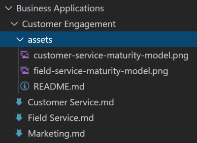

You may also have other assets like Visio diagrams or PowerPoint presentations; please keep sizes reasonable. For videos, we prefer they are hosted on a service designed for video hosting and linked to from the plan.

When you have completed your MD file, you're ready to create a pull request. This process varies depending on tooling, so for more information on doing this with GitHub desktop and Visual Studio Code, see the next section.

## Using Visual Studio Code and GitHub Desktop

Visual Studio Code and/or GitHub Desktop are powerful tools to assist in your content building. Visual Studio Code can work with GitHub directly, but some may prefer to use GitHub Desktop for those tasks, or to use another editor that doesn't have GitHub integration. 

### GitHub Desktop

GitHub Desktop is used to manage changes to and from your local machine to a GitHub repository. Download and install [GitHub Desktop](https://desktop.github.com/). Once running, you'll see an interface similar to the following that will show the current repository, branch, and any possible changes that may exist in the repository that you do not have locally. 

It is important to periodically check for changes ("Fetch Origin") because others may be making changes to the repository since you've cloned it. This process will also run periodically and allow you to download those changes; should any conflicts occur (perhaps you are working on a document that was also changed in the repository) you will have an opportunity to merge those changes by viewing specific changes within each document, should there be a conflict.

Begin by cloning the repository by selecting File -> Clone Repository. From the URL tab, enter the Partner Resources URL (https://github.com/microsoft/PartnerResources) and specify a local path to save the repository:

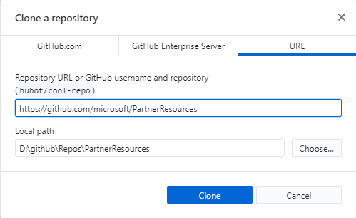

Once the files are copied to your local folder, you'd edit them as you normally would. We'll look at Visual Studio Code in a moment, but let's assume you made some changes and would like to check them in. GitHub Desktop should display all files that you've changed; the first step is to check in your changes by providing a description of all of your changes:

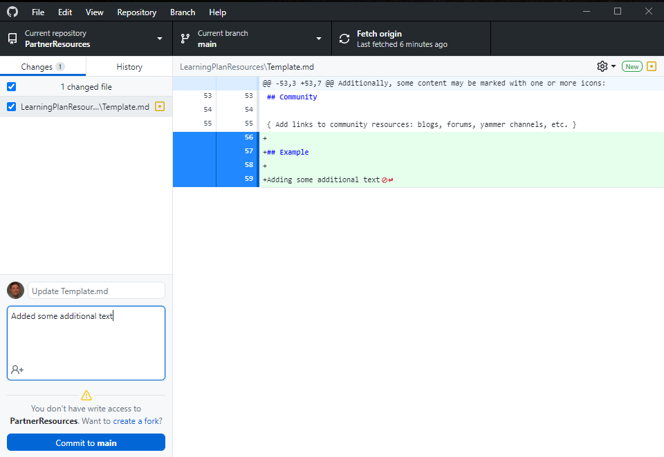

GitHub Desktop will realize you do not have permissions to directly write to the repository, so will create a fork of the repo in your own account:

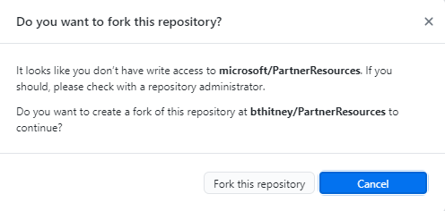

This is expected, so go ahead and fork the repository and select "Contribute to the Parent Project" on the next window:

Essentially, this allows you to stage the changes into your own account; the final step is to issue a pull request when all changes are ready to go. This can be done either through GitHub.com through your fork, or by clicking Branch -> Create Pull Request in GitHub Desktop, as shown here:

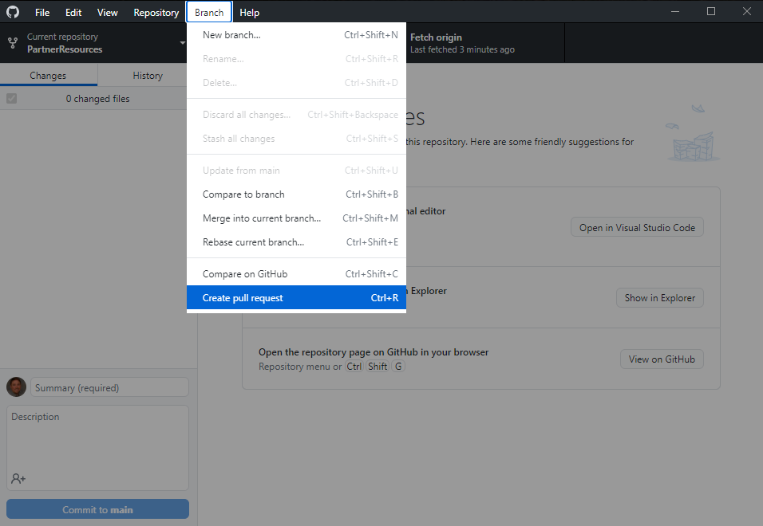

This will open the repository in a web browser, allowing you to complete the pull request. All of your changes should be here, so all that should be needed is to click the Create Pull Request button:

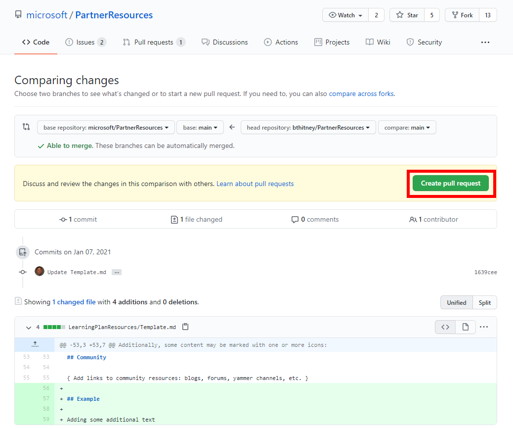

Finally, complete the pull request on the next page. Any title and description that was added earlier should be auto-populated here, but you can modify the description as needed:

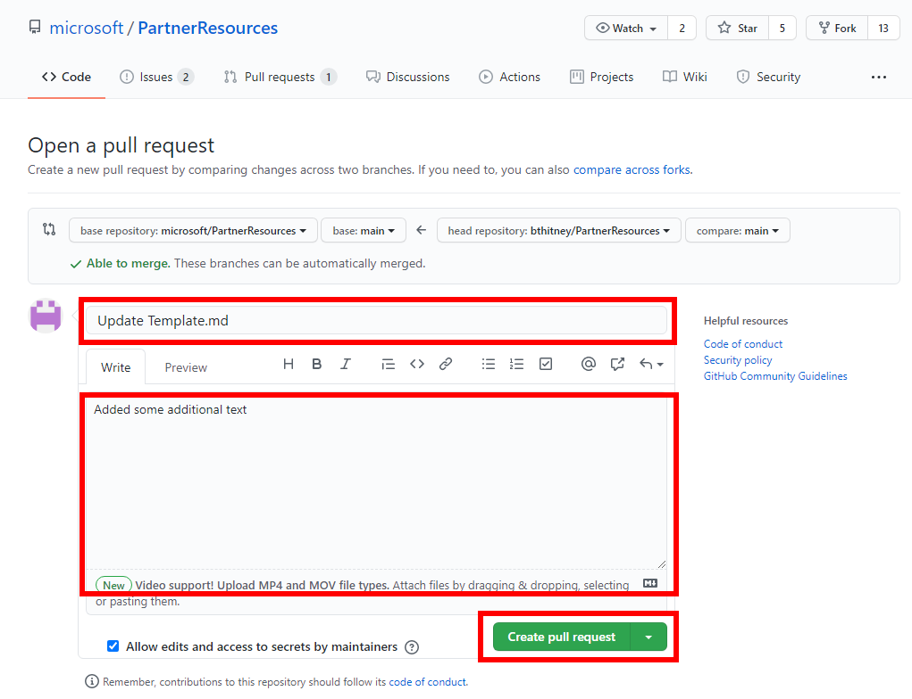

### Visual Studio Code

Visual Studio Code is a cross-platform (Mac/PC) code and text editor that can be used for modifying MD files. Visual Studio Code can interface with GitHub directly (beyond the scope of what is covered here) and can also preview MD files visually, so it's easier to see changes and make tweaks rapidly. Begin by downloading and installing [Visual Studio Code](https://code.visualstudio.com/).

There are a few ways to open the repository in Visual Studio Code.

#### Open from GitHub Desktop

If you're using GitHub Desktop, you can open the repository in Visual Studio Code easily from the GitHub Desktop application:

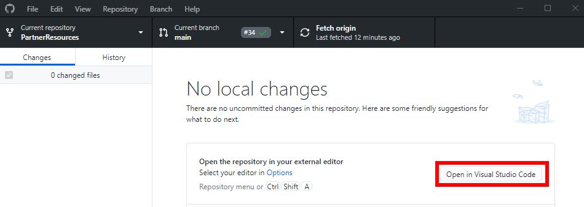

#### Open from File Explorer

On Windows, you can open Visual Studio by right-clicking in an explorer window where the repository has been cloned, and selecting Open With Code:

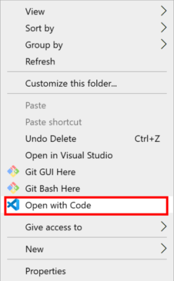

#### From within Visual Studio Code

With Visual Studio Code open, select File -> Open Folder and select the folder where the repository has been cloned.

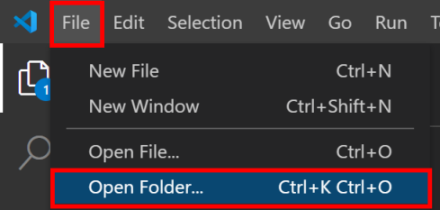

When working on MD files, you can preview the document by right clicking on the file in the top tab, and selecting Open Preview. This opens the document in a read-only preview tab, making it easier to visualize changes:

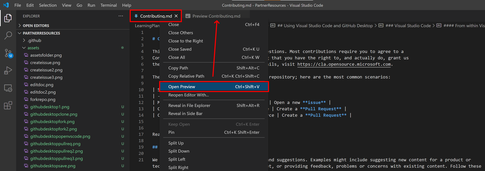
